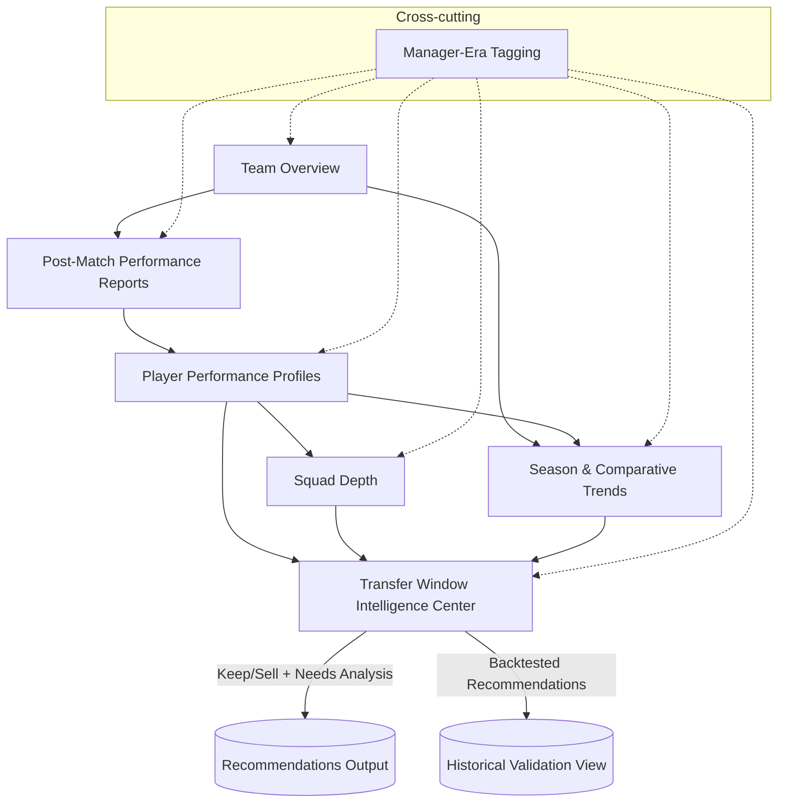

# Manchester United Analytics Dashboard — Project Specification

## 1. Vision

A post-match and transfer-window analytics platform for Manchester United, built to demonstrate
end-to-end data analytics and product-thinking skills for a football-industry data role. The
platform combines **on-pitch performance analysis** with **recruitment/scouting decision support**,
centered on a **Transfer Window Intelligence** module that turns squad data into keep/sell/buy
recommendations rather than just presenting raw stats.

Scope window: **2020–present**, chosen because it spans several distinct managerial/tactical eras
(Solskjær → Rangnick interim → ten Hag → Amorim → Carrick), giving the tactical-fit analysis a
natural, defensible segmentation instead of arbitrary date cuts.

This document defines **what** is being built and **why**. It intentionally excludes implementation
details (tech stack, data sources, pipeline design, deployment) — those are addressed in a separate
technical design document once specs are agreed.

---

## 2. Target Audience

| Audience | What they'd want from this project |
|---|---|
| **Football club recruitment/analytics staff** (primary — internship reviewers) | Evidence of decision-support thinking, not just dashboards: can this person turn data into a recommendation a scout or director of football could act on? |
| **Data/analytics hiring managers in sports generally** | Evidence of a full pipeline mindset: ingestion → modeling → serving → deployment, done properly, not a one-off notebook |
| **Fellow analysts / open-source community** | A reusable, well-documented framework others could adapt to other clubs |
| **Man United fans (secondary)** | An engaging, exploratory tool for understanding squad decisions historically |

---

## 3. Modules & Features

### 3.1 Team Overview
- Season snapshot: league position, points, goal difference, recent form (last 5 results)
- xG vs actual goals trend across a season (over/under-performance)
- Squad availability summary (injuries/suspensions, where data allows)
- Manager-era tag visible on all season views (which tactical era a given match/season falls under)

### 3.2 Post-Match Performance Reports
- Shot map with xG per shot, per match
- Pass network / average player positions per match
- xG accumulation across the 90 minutes, reconstructed post-match (explicitly **not** a live feed)
- Key match stats comparison (possession, shots, corners, cards) vs opponent
- Auto-generated match summary highlighting standout numbers
- Feature-engineered per-player match metrics feeding into Player Performance and Transfer Window modules

### 3.3 Player Performance Profiles
- Per-90 statistical profile per player, by season and by manager-era
- Radar/spider comparison against positional average
- Rolling-form trend (hot/cold streaks)
- Touches/positioning heatmap
- Discipline record (cards, fouls)
- Tactical-fit proxy score: how well a player's statistical profile matches the defining traits of
  the current manager's system (explicitly a proxy/approximation, not a validated ground-truth metric —
  no standardized industry formula for this exists)

### 3.4 Transfer Window Intelligence Center *(centerpiece module)*
- **Window summary**: incoming/outgoing players, fees, net spend, per window since 2020
- **Squad needs analysis**: identifies positional/depth weaknesses using age-curve position, minutes
  distribution, and tactical-fit scores across the current squad
- **Keep/Sell scoring**: composite score per player combining performance trend, age-curve position,
  contract length remaining, market value trend, and tactical-fit score
- **Signing scorecard**: pre-signing statistical profile (previous club) vs actual post-signing output
  at United — did the signing deliver on its statistical promise?
- **Alternatives-considered panel**: for major signings, surfaces statistically comparable players who
  were plausible alternatives at a similar position/age/price point around that window
- **Needs-vs-addressed map**: overlays pre-window squad gaps against what the window actually resolved
- **Multi-window efficiency trend**: spend vs delivered output tracked across all windows since 2020
- **Historical backtesting**: for past windows, generates what the tool "would have recommended" and
  compares it against what United actually did and how those signings performed — used as a
  credibility/validation feature

### 3.5 Season & Comparative Trends
- xG table vs actual league table (over/under-performing teams)
- Multi-season progression view for a player or the team
- Head-to-head module against a specific rival across recent meetings

### 3.6 Squad Depth
- Formation usage breakdown across a season
- Minutes distribution across the squad (rotation patterns)
- Age/contract-length matrix for succession-planning visibility

---

## 4. System Block Diagram (Conceptual Module Relationships)

This shows how modules relate and what feeds what, at a conceptual level only — no technology,
storage, or pipeline detail implied.

**Reading the diagram:**
- Team Overview and Post-Match Reports form the foundational layer other modules build on.
- Player Performance Profiles aggregates match-level data into player-level insight, and feeds both
  Season Trends and Squad Depth.
- Transfer Window Intelligence is the terminal, decision-support module — it consumes squad needs
  (from Squad Depth), player trends (from Player Performance/Season Trends), and outputs
  recommendations plus a backtested validation view.
- Manager-Era Tagging is a cross-cutting dimension applied across every module, not a module itself.

---

## 5. Known Problems / Open Challenges

These are unresolved issues to keep in mind while scoping and building — flagged now so they don't
surprise us mid-build.

1. **"Tactical fit" has no standard industry formula.** Any fit score we build is a reasoned proxy
   based on observable traits, not a validated ground-truth metric. Must be presented honestly as an
   approximation, not fact.
2. **No financial/wage-structure realism yet.** Keep/sell and signing suggestions without a budget
   constraint risk feeling like fantasy football rather than realistic recommendations. Needs a
   defined approach (even a rough net-spend ceiling per window).
3. **"Alternatives considered" data is not sitting in any single clean source.** Reconstructing who
   else was a plausible transfer target in a given window blends confirmed transfer data with
   transfer-rumor data, which is noisier and requires curation.
4. **Free-tier data sources have real gaps** — e.g., broad match/fixture coverage without detailed
   player-level stats. Any module relying on granular player data needs a data-availability check
   before feature work begins, otherwise the spec risks promising more than the data can support.
5. **Backtesting validity is limited by hindsight bias risk.** A backtest that "predicts" past signings
   using data that includes post-signing performance would be circular; needs a strict
   train/predict-forward split by window date.
6. **Injury/availability risk is not yet modeled**, but affects both keep/sell decisions and signing
   suggestions — a statistically strong but injury-prone player changes the real-world calculus.
7. **Manager-era boundaries are not always clean-cut** (interim spells, mid-season transitions) —
   need a clear, documented rule for how matches during transitional periods get tagged.
8. **Scope risk**: this is an ambitious multi-module system for a single contributor. Needs explicit
   phased delivery so the centerpiece module doesn't stall while foundational modules are incomplete.

---

## 6. Explicit Non-Goals (v1)

- No live/real-time match tracking or in-game feeds (post-match only)
- No claim of scientific validity for the tactical-fit score — it is a labeled proxy
- No actual financial/legal transfer negotiation modeling — spend estimates are illustrative
- No coverage of clubs other than Manchester United and their direct opponents in v1
